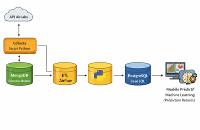
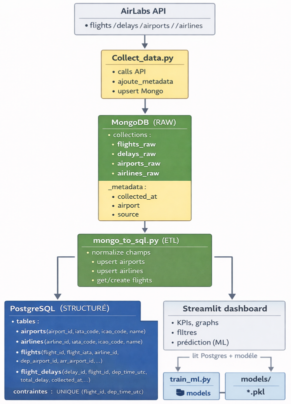
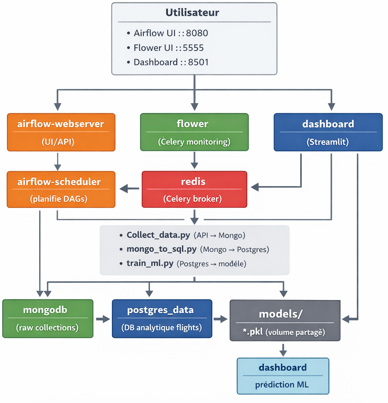

# Projet DST Airlines : 

L'objectif de ce projet est de concevoir une plateforme complète qui permet de faire la collecte, le stockage, transformation, analyse et visualisation de données aériennes, basé sur des outils de data engineering et de machine learning. 

Le projet repose sur :

- une collecte automatisée via API
- une architecture orchestrée avec Apache Airflow
- un stockage hybride MongoDB / PostgreSQL
- un dashboard interactif avec Streamlit
- un modèle de Machine Learning pour la prédiction des retards

## Source des données :

| Source | Access Method | Data |
|-------|--------------|------|
| AirLabs | https://airlabs.co/api/v9 | Flight delays, airlines, airports |

## Flux de données

### 1.Collecte

 -Collect_data.py interroge l’API AirLabs

 -Données brutes stockées dans MongoDB avec métadonnées

### 2.ETL

 -mongo_to_sql.py normalise les données

 -Upsert vers PostgreSQL (airports, airlines, flights, delays)

### 3.Machine Learning

 -train_ml.py entraîne un modèle à partir de PostgreSQL
 
 -Modèle sauvegardé au format .pkl

### 4.Visualisation & Prédiction

 -Le dashboard Streamlit lit PostgreSQL et le modèle ML
 
 -KPIs, graphiques et prédictions de retard

## Architecture et composants : 
### Architecture globale du projet

### Architecture Docker

## Services Docker: 

| Service | Description | Port |
|-------|------------|------|
| Airflow Scheduler | Planification des DAGs Airflow | 8080 (interne) |
| Airflow Webserver | Interface Web & API Airflow | 8080 |
| Airflow Worker | Exécution des tâches Airflow (Celery) | 8080 (interne) |
| Flower | Monitoring Celery | 5555 |
| Dashboard | Application Streamlit (visualisation & ML) | 8501 |
| PostgreSQL (Data) | Base de données analytique (flights) | 5432 |
| Redis | Broker Celery | 6379 (interne) |
| MongoDB | Base NoSQL (données brutes) | 27017 |
| PostgreSQL (Airflow) | Base metadata Airflow | 5432 (interne) |

## Automatisation et planification : 

L’automatisation du pipeline de données est assurée par Apache Airflow, permettant l’exécution planifiée, fiable et reproductible des différentes étapes : collecte, transformation, entraînement ML et mise à disposition des résultats.

- Orchestration avec Airflow :

Le pipeline est implémenté sous forme de DAG Airflow, composé de tâches Python exécutées de manière séquentielle et/ou parallèle.
 	- DAG airlines_collect_etl : Collecte et transforme les données toutes les 30 minutes
	- DAG airlines_train_daily : Entraine le modèle de les jours à 18h15

==============================

Structure du projet 
------------

    ├── airflow/
    │   ├── dags/
    │   │   ├── airlines_collect_etl.py
    │   │   ├── airlines_train_daily.py
    │   ├── scripts/
    │   │   ├── Collect_data.py
    │   │   ├── mongo_to_sql.py
    │   │   ├── train_ml.py
    │   ├── plugins/
    │   └── logs/
    ├── airflow-image/
    │   ├── Dockerfile
    │   └── requirements.txt
    ├── dashboard/
    │   ├── Dockerfile
    │   ├── dashboard_vols.py
    │   └── requirements.txt
    ├── infra/
    │   ├── init.sql
    ├── docs
    ├── docker-compose.yml
    ├── README.md
    ├── .gitignore
    └── .env.example
--------

<small>Project based on the <a target="_blank" href="https://drivendata.github.io/cookiecutter-data-science/">cookiecutter data science project template</a>. #cookiecutterdatascience</small>

==============================
Installation : 
==============================
1- Cloner le repository 

2- Créer un compte chez Airlabs.com pour avoir une api_key

3- Copier le fichier .env.exemple > .env et remplacer la variable api_key par votre clé  

4- Lancer les commandes : 

- docker-compose build 
- docker-compose up -d

5- Vous devez rentrer le mot de passe de la base des donnée Postresql :
- docker-compose exec postgres_data psql -U postgres -d flight
- ALTER USER postgres WITH PASSWORD 'postgres';
- docker-compose restart dashboard

6 - Si vous avez des problèmes de permissions, lancer les commandes suivantes : 

- mkdir -p airflow/logs airflow/plugins airflow/dags models
- sudo chown -R 50000:0 airflow/logs airflow/plugins airflow/dags models
- sudo chmod -R ug+rwX airflow/logs airflow/plugins airflow/dags models

puis : 

- docker-compose down
- docker-compose up -d

7- Accéder à l'UI Airflow sur votre navigateur via : adressIP:8080 

Puis lancer le dag airlines_collect_etl

Laisser tourner pour collecter assez de donnée puis lancer le dag airlines_train_daily

8- Accéder au dashboard Streamlit sur le navigateur via : adressIP:8501

Il y a deux onglets : 

- Dashboard : vous permet de visualiser les différentes informations surs les vols 

- Prédiction : vous permet de prédire le retard d'un départ d'un vol en minutes en introduisant les différentes données préable d'un vol. 
